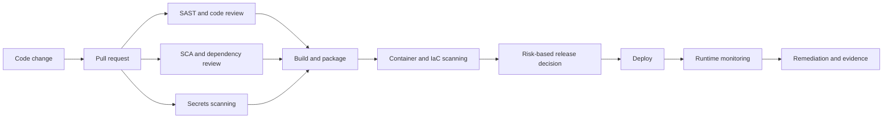

# Application Security Knowledge Base

Author: Samuel Cheung

## Overview

This repository is a professional Application Security knowledge base. It captures practical security engineering thinking across modern software delivery, cloud platforms, third-party dependencies, and AI-enabled applications.

It is organised as a working reference for understanding risk, selecting controls, and connecting security decisions to software delivery.

Application Security is the discipline of building, reviewing, deploying, and operating software in a way that protects users, data, business processes, and digital services. It includes secure design, secure coding, threat modelling, security testing, dependency governance, cloud controls, CI/CD automation, and evidence-based risk management.

The focus of this repository is defensive security engineering. It does not provide exploit walkthroughs, weaponized code, or CTF-style material. The emphasis is on how a security engineer helps organisations ship software safely.

## Why Modern AppSec Matters

Modern applications are assembled from internal code, open source packages, cloud services, APIs, containers, CI/CD workflows, third-party integrations, and increasingly AI-enabled features. A weakness in any part of that chain can create business risk.

Good AppSec is not a one-time penetration test at the end of a project. It is an engineering practice that gives teams useful feedback early, keeps production risk visible, and helps leaders make informed decisions about security, delivery speed, customer trust, and compliance.

Practical AppSec work often involves:

- explaining technical risk in business language
- designing controls that fit engineering workflows
- reviewing authentication, authorization, data handling, and trust boundaries
- using SAST, SCA, DAST, secrets scanning, container scanning, and IaC scanning appropriately
- prioritising remediation based on exploitability, exposure, asset criticality, and business impact
- creating evidence for governance, audit, and risk acceptance

## Practical Artifacts

The strongest material in this repository is designed to show how application security decisions are made in practice:

- [Application security assessment sample](case-studies/appsec-assessment-sample.md)
- [DevSecOps reference architecture](devsecops/reference-architecture.md)
- [RAG threat model](ai-security/rag-threat-model.md)
- [Case studies](case-studies/README.md)
- [Security engineering briefs](docs/security-engineering-briefs.md)
- [Control matrix](references/control-matrix.md)

## Repository Structure

| Area | Purpose |
| --- | --- |
| [domains](domains/README.md) | Core Application Security knowledge domains |
| [case-studies](case-studies) | Real-world security incidents explained from a defensive engineering perspective |
| [tools](tools) | Security tooling briefs and practical tool positioning |
| [devsecops](devsecops/README.md) | Secure delivery, CI/CD controls, and automation patterns |
| [cloud-security](cloud-security/README.md) | Cloud application security considerations |
| [ai-security](ai-security/README.md) | AI application security and governance topics |
| [references](references/README.md) | Reference model for frameworks, standards, and further expansion |

## Security Delivery Model

## Key Learning Domains

### 1. OWASP Top 10

The OWASP Top 10 is used here as a practical risk model, not as a memorisation list. The focus is on business impact, detection, prevention, and clear security explanation.

Covered topics:

- [A01 Broken Access Control](docs/A01-Broken-Access-Control.md)
- [A03 Injection](docs/A03-Injection.md)
- [A05 Security Misconfiguration](docs/A05-Security-Misconfiguration.md)
- [A06 Vulnerable and Outdated Components](docs/A06-Vulnerable-Components.md)
- [A10 Server-Side Request Forgery](docs/A10-SSRF.md)

### 2. Application Security Tooling

Security tools are explained by where they fit in the SDLC and what decision they help a team make. Tool output is treated as an input to engineering judgement, not as automatic proof of risk.

Featured tools:

- [Snyk](tools/snyk-overview.md)
- [Checkmarx](tools/checkmarx-overview.md)
- [SonarQube](tools/sonarqube-overview.md)
- [Veracode](tools/veracode-overview.md)
- [GitHub CodeQL](tools/codeql-overview.md)
- [OWASP ZAP](tools/owasp-zap-overview.md)
- [OWASP Dependency-Check](tools/dependency-check-overview.md)

### 3. DevSecOps

DevSecOps is presented as security integration into delivery, not as adding more gates. The focus is on pull request feedback, CI/CD security controls, evidence capture, exception handling, and remediation ownership.

Start with:

- [DevSecOps overview](devsecops/README.md)
- [Pipeline reference](docs/devsecops-pipeline-overview.md)
- [Example GitHub Actions security workflow](examples/github-actions-security-pipeline.yml)

### 4. Software Supply Chain Security

Supply chain security focuses on dependency visibility, third-party software risk, SBOMs, patching, and continuous monitoring. The goal is to answer urgent questions quickly when a component, vendor, or integration becomes risky.

Featured case studies:

- [Log4Shell](case-studies/log4shell.md)
- [SolarWinds](case-studies/solarwinds.md)
- [MOVEit](case-studies/moveit.md)

### 5. AI Application Security

AI security focuses on new trust boundaries created by LLMs, prompts, retrieval systems, model outputs, enterprise data, and human approval workflows. The goal is practical governance and control design for AI-enabled applications.

Start with:

- [AI Security overview](ai-security/README.md)

## Featured Case Studies

| Case Study | Security Lesson |
| --- | --- |
| [Log4Shell](case-studies/log4shell.md) | Dependency inventory, SCA, SBOMs, patch urgency, and exposure-based prioritisation |
| [SolarWinds](case-studies/solarwinds.md) | Build pipeline trust, vendor risk, software integrity, and supply chain monitoring |
| [MOVEit](case-studies/moveit.md) | Managed file transfer exposure, third-party service risk, incident response, and data impact analysis |

## Featured Security Tools

| Tool | Primary Use | Where It Fits |
| --- | --- | --- |
| Snyk | SCA, SAST, container, IaC | Developer workflow, pull requests, CI/CD, dependency monitoring |
| Checkmarx | SAST | Enterprise source code review and AppSec governance |
| SonarQube | Code quality and security hotspots | Engineering quality and secure coding review |
| Veracode | SAST, DAST, SCA | Enterprise application security program management |
| GitHub CodeQL | Semantic code analysis | GitHub-native SAST and pull request review |
| OWASP ZAP | DAST | Running application testing and baseline web checks |
| OWASP Dependency-Check | SCA | Open source dependency vulnerability visibility |

## Future Roadmap

| Phase | Focus |
| --- | --- |
| Phase 1 | Build the foundational AppSec knowledge base |
| Phase 2 | Add practical Snyk and CodeQL examples |
| Phase 3 | Add DevSecOps reference architectures |
| Phase 4 | Add Cloud Application Security content |
| Phase 5 | Add AI Security and AI Governance content |

## Positioning

This repository demonstrates practical Application Security, DevSecOps, Cloud Security, Software Supply Chain Security, and AI Security thinking at a professional level.

The strongest AppSec engineers do more than find issues. They help teams understand risk, choose proportionate controls, improve delivery systems, and make security part of how software is built.

## Disclaimer

This repository is for educational and defensive security purposes only. It is not legal advice, production-ready tooling, or a substitute for environment-specific security review.
